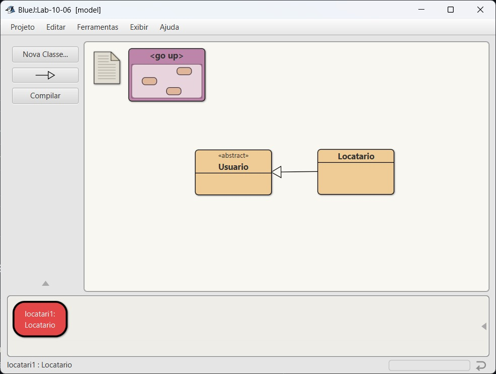

# Implementação: ORM de uma classe Modelo do Projeto 

Estudante: Danielly Khalil Cândido Teixeira - [Github](https://github.com/Khalielly)

Estudante: Ana Clara Leones Da Silva - [Github](https://github.com/claraleones)

Estudante: Miguel Carlos Costa Sousa[Github](https://github.com/miguelccs10)

Este projeto Java tem como objetivo demonstrar o uso do banco de dados SQLite em conjunto com a biblioteca ORMLite para realizar operações básicas  como **inserir, consultar, atualizar e deletar** registros.

---

##  Estrutura do Projeto

O projeto é dividido em três principais componentes:

- **Classe `Main`**: Responsável por executar as ações principais do sistema.
- **Classe `Database`**: Responsável por estabelecer a conexão com o banco de dados SQLite.
- **Classe `Locatario`**: Representa o modelo de dados, ou seja, um locatário que será armazenado no banco.

---

## Resultado 

